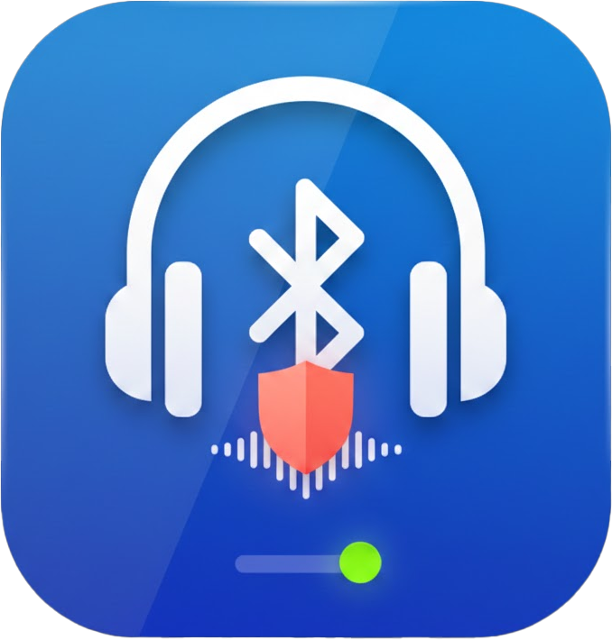

<p align="center">
  
</p>

<h1 align="center">SoundGuard</h1>

<p align="center">
  <b>Bluetooth Hands-Free Profile (HFP) Manager for Windows</b><br>
  Take control of your audio quality by disabling the low-quality Hands-Free telephony service on Bluetooth headphones.
</p>

<p align="center">
  
  
  
</p>

---

## What is SoundGuard?

When you connect a Bluetooth headset to Windows, the system registers two audio profiles:

| Profile | Quality | Use Case |
|---------|---------|----------|
| **A2DP** (Advanced Audio Distribution) | High quality stereo | Music, gaming, media |
| **HFP** (Hands-Free Profile) | Low quality mono | Phone calls, voice chat |

Windows often defaults to HFP for communication apps, drastically reducing audio quality. **SoundGuard** lets you disable the HFP service per-device directly from the system tray — forcing Windows to use A2DP for everything.

## Features

- 🎧 **One-click HFP toggle** — Enable or disable the Hands-Free service per Bluetooth device
- 🔔 **System tray integration** — Lives quietly in your taskbar, always accessible
- ⚡ **Lightweight** — Minimal resource usage, no background polling
- 🎨 **Dark UI** — Clean, modern popup with device status indicators
- 🔒 **Admin-level control** — Uses Windows SetupAPI/CfgMgr32 for reliable device management

## Installation

### Requirements

- Windows 10 or Windows 11
- .NET 8.0 Runtime
- Administrator privileges (required to manage Bluetooth device services)

### Build from Source

```bash
git clone https://github.com/mertflx/SoundGuard.git
cd SoundGuard
dotnet build SoundGuard.csproj -c Release
```

### Run

```bash
dotnet run --project SoundGuard.csproj
```

Or run the compiled executable from `bin/Release/net8.0-windows/SoundGuard.exe` (right-click → **Run as Administrator**).

## Usage

1. Launch **SoundGuard** — it appears as a headphone icon in the system tray
2. **Left-click** the tray icon to open the device popup
3. Toggle the switch next to any Bluetooth device to enable/disable its HFP service
4. **Right-click** for options: Refresh, About, Exit

## Project Structure

```
SoundGuard/
├── App.xaml / App.xaml.cs          # Application entry point
├── Views/
│   ├── DevicePopup.xaml(.cs)       # Device list popup window
│   └── TrayIconManager.cs         # System tray icon & context menu
├── Services/
│   └── HandsFreeServiceManager.cs  # HFP device detection & management
├── Models/
│   └── BluetoothDeviceInfo.cs      # Device data model
├── Interop/
│   ├── NativeMethods.cs            # P/Invoke declarations (SetupAPI, CfgMgr32)
│   └── DeviceInterop.cs            # Managed wrappers for native calls
├── Resources/
│   ├── Logo.ico                    # Application icon
│   └── Logo.png                    # High-res logo
└── SoundGuard.csproj               # Project configuration
```

## How It Works

SoundGuard uses two detection strategies:

1. **PowerShell** (`Get-PnpDevice`) — Primary method, queries for `BTHENUM` devices with the HFP GUID (`0000111E`)
2. **SetupAPI** — Fallback method using native Windows APIs for device enumeration

Device enable/disable is performed via **CfgMgr32** native APIs (`CM_Enable_DevNode` / `CM_Disable_DevNode`), which is the same mechanism Windows Device Manager uses internally.

## License

This project is licensed under the [MIT License](LICENSE).
